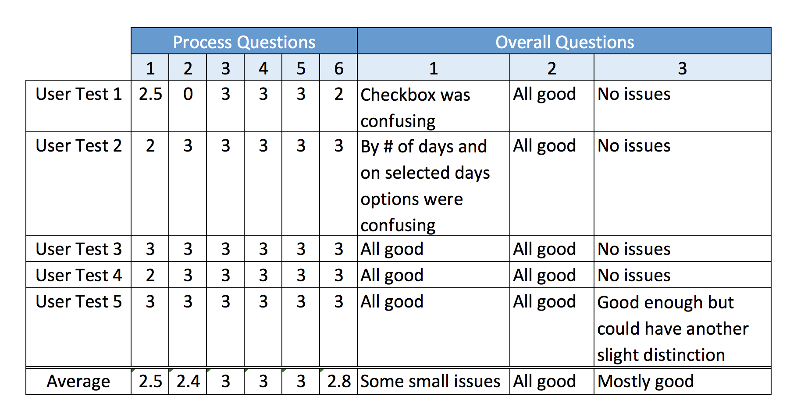

# User Testing Results

## Testing Metric
0: User was unable to complete the task  
1: User came close to completing the task  
2: User completed the task with some issues  
3: User completed the task without trouble  

## Testing Results

## Reflections
Overall, I recieved a lot of positive feedback from user testing. In general, the users were able to navigate the app and complete the given tasks with minimal trouble.  
  
Of all the tasks, people had the most trouble with task 1. This was mainly due to confusion around the two different types of goal streaks, though most users were able to correct themselves quickly. Interestingly, one user was unable to complete task 2 while all others completed it without trouble. I think this is because the user ended up on the goal detail page, which does not have an option to check off the goal even though it shows most other goal details.  
  
I clarified some of the instructions after my first user test which I think helped the following users understand the tasks better and therefore complete them more easily. This also helped them avoid troubles due to the limitations of the prototype.

## Resulting Changes to App
- add the goal completion checkbox to the goal details page as well as the main page
- add a help button which explains the two types of goal streaks in more detail (this addition would be nice to have, but is not essential)

